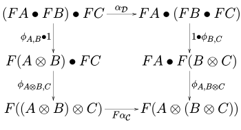
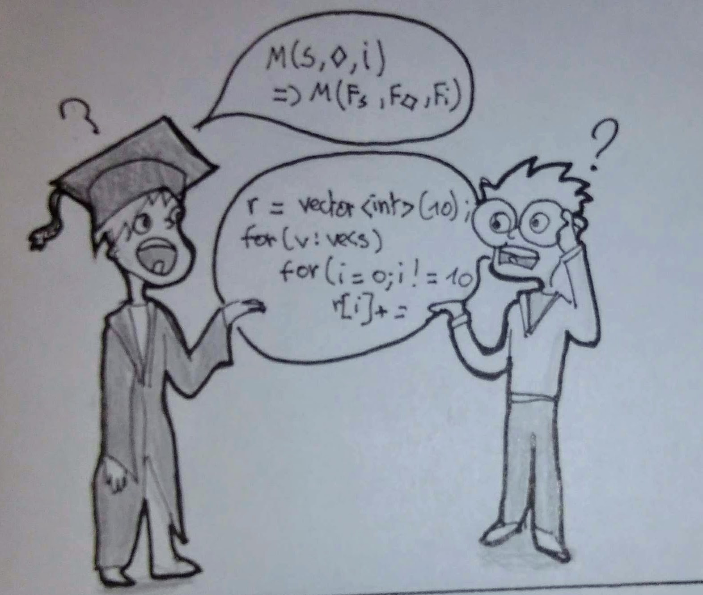
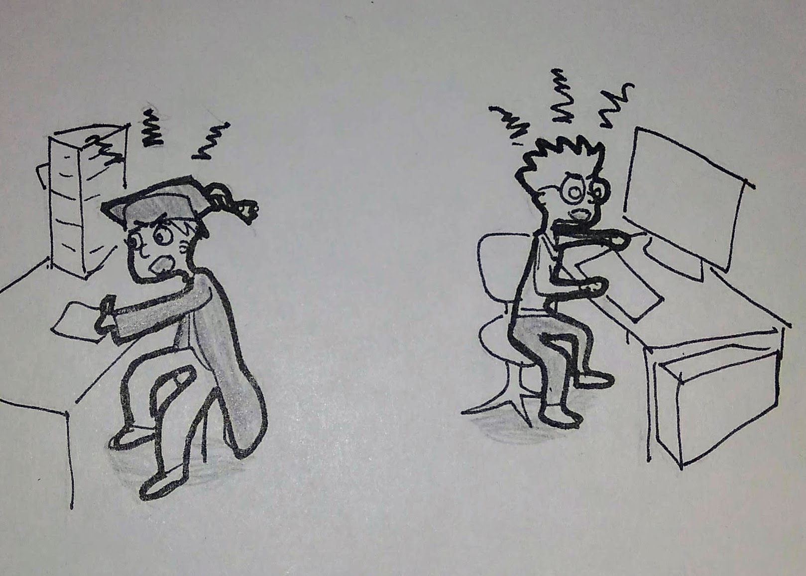
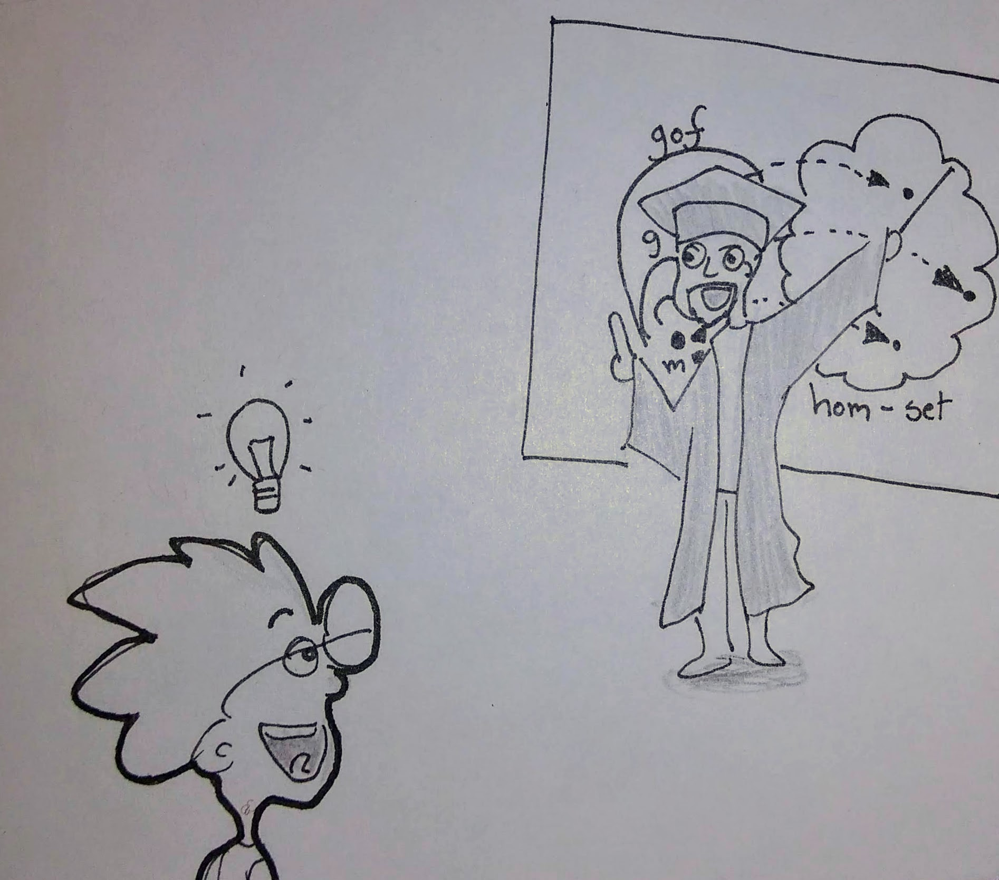
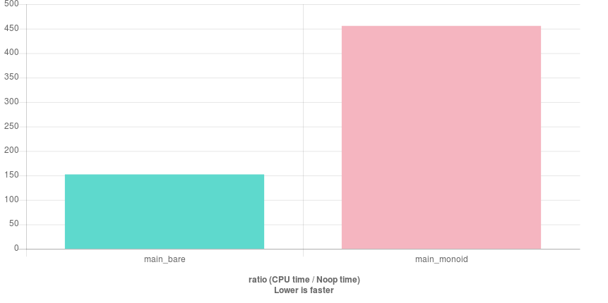

<!-- .slide: style="text-align: left;"> -->

title: Using Monoids in C++
<span style="font-size:.4em; margin-right:0">v1.2</span>

author: Kristoffel Pirard

url: http://github.com/xtofl/articles/monoid/monoid.md


<div style="font-size:.4em">
[(single-page version)](?print-pdf&pdfSeparateFragments=false)
</div>

<div style="font-size:.4em">
This slide deck is intended for use with reveal.js;
</div>
<div style="font-size:.4em">
```
articles> make monoid/monoid.reveal
```
</div>

---

# Using Monoids in C++


 <!-- .element: width="300" style="display: block; margin-left: auto; margin-right: auto;" -->
<div style="font-size:.4em">credit: Bartosz Milewski</div>

---

## Why am I doing this?

* we, developers, need
  * proven methodologies (scaling the dev process)
  * reuse, over language boundaries
* mathematicians: building theorems for ages
* we don't understand Mathematese and FP-ish
  * cf. the `iota` discussions lately
* mathematicians don't speak Developese (nobody does)

--

## Why am I doing this

* I'm enthousiastic (a bit nerdy)
  * c'mon... ["lenses, bananas, barbed wire"](https://maartenfokkinga.github.io/utwente/mmf91m.pdf) in one sentence!
* I think we _will_ benefit (FP matters)
* Can you help me?
  * I want to help _you_ taking the first hurdle
  * Let's take the rest together!

--

## What I want to achieve

whetting some appetite for FP

<div class="fragment" style="font-size:.5em;">no - fp's not going to solve all your problems</div>

---

## How I got here


* I have to take care of the family groceries for some weeks
* finding my way around a store??? <!-- .element: class="fragment" -->
* always too much in my cart <!-- .element: class="fragment" -->
* always important stuff missing <!-- .element: class="fragment" -->
* stores are crowded from 10am.  <!-- .element: class="fragment" -->

Note: < 3 minutes

--

But... what groceries do I need?

* Week menu
* Recipes
* Pantry

--

* 5 chipolata's, 2kg potatoes, 5 apples, 2 packs of pasta, 400g of minced meat, grated cheese, chicken breast, basmati rice, curry sauce ...
* O - we still got potatoes.  <!-- .element: class="fragment" -->
* ... and 5 packs of curry sauce  <!-- .element: class="fragment" -->

--

Week

after week

after week

_can't a computer do that_?

--

I wish I could do...
```bash
> python3 growser.py
o currysaus <1 pak>
o chipolata <1 pak>
o basmati <1 kg>
...
```

--

```python
shopping_list_menu = resulting_list(all_dishes, pantry)
shopping_list = join_ingredients(shopping_list_menu, extras)
print_ingredients(shopping_list, shop=the_shop)
```

--

But look at that code... :(

```python
cart = {}
for dish in menu:
    for i in dish.ingredients:
        if not i.name in cart:
            cart[i.name] = i.amount
        else:
            assert
            cart[i.name].amount.unit == i.amount.unit
            cart[i.name].amount.n += i.amount.n
```

--

## Meanwhile

Reading about Category Theory, bumping into terms like

* Monoid
* Functor (+ the great - debate)
* Monad
* Applicative
* ...

wooow.... scary! <!-- .element: class="fragment" -->

--

Discussions about 'vacuous truth/falsity'

```
* all({true, false, true}) == false
* all({true}) == true
* all({}) == ????
```

--

## `</How I got here>`

--

And then something 'clicked'.

```python
cart = {}
for dish in menu:
    for i in dish.ingredients:
        if not i.name in cart:
            cart[i.name] = i.amount
        else:
            assert
            cart[i.name].amount.unit == i.amount.unit
            cart[i.name].amount.n += i.amount.n
```

Imagine using a default-dict here.

And a way to 'add' dicts, key-wise...

--

```python
cart = sum(dish.ingredients for dish in menu)
```

How come I didn't think of that sooner?

--

## Why the Detour?

* my imperative background
* lack of concepts to express this

--

## Why lack of Concepts?

<p class="fragment">
... dreaming during math class?
</p>


<p class="fragment">
The 'math' lingo does not map onto 'programming'.
</p>

<p class="fragment">
Lack of _application_
</p>

--

### Math Lingo

[](https://en.wikipedia.org/wiki/Monoidal_functor#Definition)
<div style="font-size:.4em">credit: wikipedia</div>

--

### Misunderstanding

= lingo mismatch

  <!-- .element: height="400" -->
<div style="font-size:.4em">credit: Jona</div>

--


### Anger

  <!-- .element: height="400" -->
<div style="font-size:.4em">credit: Jona</div>

Note: yoda may fit in here.

--

## Knowledge for the win

* Scientists tend to be clever  <!-- .element: class="fragment" -->
* Common vocabulary => more collaboration <!-- .element: class="fragment" -->
  * with scientists
  * amongst developers

--

## This presentation is

An attempt to take away some fear and some dismay

=> small steps!, real-life <sup>*</sup>!

<p style="font-size:.4em;">adapted from -</p>

--

This may look like part of a Category Theory course

* Monoid <-- we are here
* Functor
* Applicative
* Monad

but it's not.

--

But we may _need_ such courses

  <!-- .element: height="400" -->
<div style="font-size:.4em">credit: Jona</div>


---

## What are Monoids

--

### Monoid: back to school

* Back to school: addition
  * 1 + 2 == 3  <!-- .element: class="fragment" -->
  * 234225 + 123415115 == 123649340  <!-- .element: class="fragment" -->
  * 1 + (2 + 3) == (1 + 2) + 3  <!-- .element: class="fragment" -->
  * 0 + x == x  <!-- .element: class="fragment" -->
  * x + 0 == x  <!-- .element: class="fragment" -->

--

### Monoid: back to school

* Back to school: multiplication
  - 3 &middot; 2 == 6  <!-- .element: class="fragment" -->
  - 165 &middot; 23 == 3795  <!-- .element: class="fragment" -->
  - 4 &middot; ( 2 &middot; 3 ) == ( 4 &middot; 2 ) &middot; 3  <!-- .element: class="fragment" -->
  - 1 &middot; x == x  <!-- .element: class="fragment" -->
  - x &middot; 1 == x  <!-- .element: class="fragment" -->

--

### Generalizing

* &plus; and &middot; are binary operations on ℕ
  * closed
  * associative
  * with an identity element (resp. 0 and 1)

--

### Monoid Definition

A Monoid is a tuple `<S, op, id>` so that

* op(s1, s2) element of S
* op(s1, op(s2, s3)) == op(op(s1, s2), s3)
* op(id, s) == op(s, id) == s

--

### Generalizing: math notation

Monoid: a tuple &lt;S, &diamond;, id&gt; so that

* &forall; s1, s2, s3 &isin; S
    * (s1 &diamond; s2) &isin; S
    * s1 &diamond; (s2 &diamond; s3) == (s1 &diamond; s2) &diamond; s3
    * id &diamond; s == s == s &diamond; id


--

  <!-- .element: height="400" -->
<div style="font-size:.4em">credit: Jona</div>

--

### Examples: &lt;bool, &amp;&amp;, true&gt;

```C++
* a && b is a boolean
* a && (b && c) == (a && b) && c
* a && true == a, true && a == a
```

--

### Examples: &lt;bool, ||, false&gt;

```C++
* a || b is a boolean
* a || (b || c) == (a || b) || c
* a || false == a, false || a == a
```

--

### Examples: &lt;string, +, ""&gt;

```C++
string string::append(string)
string operator+(string, string)
"ab"s + ("cd"s + "ef"s) == ("ab"s + "cd"s) + "ef"s
"ab"s + ""s == "ab"s == ""s + "ab"s
```

--

### Examples: floating point

```C++
double operator+(double, double)
.5 + (1. + 2.) == (.5 + 1.) + 2.
.5 + 0. == 0. + .5 == .5
```

--

### Examples: floating point

```C++
.1 + (.2 + .3) == (.1 + .2) + .3
```

**NOT** associative!

<div style="font-size:.5em">(unless you can live with a small error)</div>

---

## What are Monoids Good for?

--

### So... what good is it?

Generic functions, of course!

Functions first defined on Ranges can often be generalized to any monoid.

* Runtime
* Compile time
* Shopping time <!-- .element: class="fragment">

--

### What else?

* When this is part of your vocabulary:
    * CppCoreGuideline: [P.3 express intent](https://github.com/isocpp/CppCoreGuidelines/blob/master/CppCoreGuidelines.md#p3-express-intent)
* ... when it is not, you'll bump into:
    * CppCoreGuideline: [P.13 Use ... as appropriate](https://github.com/isocpp/CppCoreGuidelines/blob/master/CppCoreGuidelines.md#p13-use-support-libraries-as-appropriate)

--

## What's good about the Laws

* Closure
* Associativity
* An identity element

--

#### Closure

* Operation can be chained
  * "define pairwise => get range operation for free"
* Only 1 type needed
  * less mental burden
  * less template arguments

--

#### Closure

```C++
// explicit knowledge
template<typename InputIt, typename T,
         typename BinaryOperation>
T accumulate(InputIt b, InputIt e, T init,
              BinaryOperation op );
// requires BinaryOperation to satisfy
// T t = op(t, *first)
```

vs

```C++
// implicit knowledge
template<typename InputIt, typename Monoid>
Monoid accumulate(InputIt b, InputIt e);
```

Note: conservation of complexity: it is moved into the Monoid type

--

#### Associativity

Divide and Conquer

```C++
acc(a, b, c, d) ==
    acc(
        acc(a, b),
        acc(c, d)
    )
```

  * => parallelization
  * Incrementalism

--

#### An identity element

* operation with 'empty' lists (vacuus truth?)
* allow 'restarting' computation
    * each part can start from "zero"
* less mental burden


--

## Treasure Trove

Theorems for Free!

* m, n are monoid => algebraic types of m, n, too
    * <span style="font-size:.7em">`tuple<int, bool>` under `(+, ||)` with `id=(0, false)`</span>
* function composition is a monoid
    * great for pipes and filters pattern!
    * <span style="font-size:.7em">`foo(bar(baz(m))) == mconcat({foo, bar, baz})(m)`</span>
* [O(log(N)) parser](http://www.dcc.fc.up.pt/~acm/semigr.pdf)
* ...

--

But we need translators

---

## Applying it in C++

--

## Creating a Monoid in C++

Goal:

Define and use `mconcat(begin, end) -> M`

```
auto result = mconcat(begin(xs), end(xs));
```

--

### Different approaches

* overload `operator +` and add a `0` constructor
  * very very implicit.  monkey-patching, almost
* template specialization
* use semantic types (concepts may help!)

Let's take the wrong turn first.

--

Generic `mappend` and `mempty`

```
template<typename T> T mempty();
template<typename T> T mappend(T, T);

template<typename M>
auto mconcat(It b, It e) {
    return accumulate(
        b, e,
        mempty<Monoid>(),
        mappend<Monoid>);
}
```

--

Specialization for `int` addition

```
template<>
int mempty<int>() { return 0; }

template<>
int mappend<int>(int a, int b) { return a + b; }
```

```
std::vector<int> ints{{1, 2, 3, 4}};
EXPECT_EQ(10, mconcat(begin(ints), end(ints)));
```

--

And for a custom type

```
struct Custom {
    std::string s;
    int n;
};
```
```
template<>
Custom mempty<Custom>() { return {}; }
template<>
Custom mappend<Custom>(Custom c, Custom d) {
    return {
        c.s.append(d.s),
        c.n + d.n
    };
}
```

--

### Let's break it

For int product:
```
template<>
int mempty<int>() { return 1; }
template<>
int mappend<int>(int a, int b) { return a * b; }
```

Can we have 2 specializations for `int`?

<div class="fragment">Didn't think so

<pre>
// error: redefinition of
// ‘T overloading::mempty() [with T = int]’
</pre>
</div>

--

So some extra info is needed

Look mom!  Semantic types!  <!-- .element: class="fragment" -->

```
template<typename T> struct Sum {
    T t;
    static Sum mempty() { return {}; }
    static Sum mappend(Sum a, Sum b) {
        return {a.t + b.t};
    }
};
```

```
template<typename T> struct Product {
    T t;
    static Product mempty() { return {1}; };
    static Product mappend(Product a, Product b) {
        return {a.t * b.t};
    }
};
```

--

```
auto s = mconcat<Sum<int>>(b, e).t;
auto p = mconcat<Product<int>>(b, e).t;
```

--

## But isn't it slow?

[thanks, quick-bench!](http://quick-bench.com/mEJDA6p6zEdR_Wg-Yo_PkXXYwto)


```
accumulate(begin(ints), end(ints), 0);
mconcat<Sum<int>>(begin(ints), end(ints));
```
  <!-- .element: height="300" -->

<span style="font-size: .5em">
(-O3 and -O2; for -O1, there's a 10% penalty)
Cf. also [Linear Types](https://meetingcpp.com/mcpp/slides/2018/lin.pdf)/[ligthning talk](https://www.youtube.com/watch?v=sN8tI-zleFI)
</span>


--

### The Grocery List.

Define some simple data types:

```
using Name = std::string;
using Amount = int;
using GroceryList = std::map<Name, Amount>
```

--

Example dishes

| name | dish1 | dish2 | dish3 |
| -- | -- | -- | -- |
| carrots | 5 |  | 10 |
| minced meat | 300g | 300g | |
| rice | 200g | 200g | |
| spaghetti | | | 400g |


--

### Before

```
template<typename It>
GroceryList join_grocerylists(It b, It e) {
    static_assert(std::is_same_v<typename It::value_type,
                                 GroceryList>);
    GroceryList result{};
    for( ; b!=e ; ++b) {
        for(const auto &ingredient: b->items) {
            result.items[ingredient.first] += 
                ingredient.second;
        }
    }
    return result;
}
```

--

### The Sum<GroceryList> monoid

```
template<> struct Sum<GroceryList> {
    using T = GroceryList;
    T t;

    static Sum mempty() { return {}; }

    static Sum mappend(Sum a, Sum b) {
        for (const auto &ib: b.t.items) {
            a.t.items[ib.first] += ib.second;
        }
        return {a};
    }
};
```

--

### After

```
template<typename It>
auto join_grocerylists(It b, It e) {
    return mconcat<Sum<GroceryList>>(b, e);
}
```

--


## But Wait - There's More

Remember: Algebraic Data Types composed of Monoids are also Monoids.

A `map<K, V>` resembles an 'infinite struct' of values.

So...

Would `map<K, Monoid>` also form a Monoid?


--

Imagine we can 'declare' the monoid _within_ a `map`
```C++
mconcat<FSum<IntMap, Sum<int>>>(
        begin(intmaps), end(intmaps)).t)
```


--

We Can!

```
template<typename Map, typename Monoid>
struct FSum {...};
```
```
    static FSum mappend(FSum a, FSum b) {
        for(const auto& kv: b.t) {
            auto &xa = a.t[kv.first]; //(use mempty!)
            auto xb = kv.second;
            xa = Monoid::mappend(Monoid{xa}, Monoid{xb}).t;
        }
        return a;
    }
```
--

```C++
std::vector<IntMap> intmaps{
    { {1, 1}, {2, 4}, {3, 9} },
    { {1, 2}, {2, 3}, {3, 4} }};
const IntMap expected{
    { {1, 3}, {2, 7}, {3, 13} }};

EXPECT_EQ(expected,
    (mconcat<FSum<IntMap, Sum<int>>>(
        begin(intmaps), end(intmaps)).t));
```

--

### C++20: Concepts

```
template<typename It, typename T>
    requires Monoid<T>
auto mconcat(It b, It e) {...}
```

--

## What if: no Unit

Some times you have no Unit

* Non-empty lists
* Counting from 1

--

## Add a Unit

You can create a 'Sum' type using `std::variant` or `std::optional`:

* N = {1, 2, 3, 4, ...}
* M<sub>N</sub> = {None} &cup; N

--

## Add a Unit

In C++... use an `optional<T>`

```
auto Sum<optional<T>>::mempty() {
    return {{}};
}
auto Sum<optional<T>>::mappend(Sum<...> a, Sum<...> b) {
    return {(a.t && b.t)
        ? mappend(*a.t, *b.t);
        : mempty<O<T>>()};
}
```

---

## Conclusion

* Math and Category theory: treasure island
    * Can be used in C++
    * Establish common vocabulary
    * Reduce complexity through _known abstractions_
* I'm afraid of the math lingo
    * But I'm not alone
    * Baby steps (note [lambda cast](https://soundcloud.com/lambda-cast))


--

## Translators needed!

* (&lambda;) slack Cpplang [#fp channel](https://cpplang.slack.com/messages/C2SRA568G/)
* (&lambda;) [lambda cast](https://soundcloud.com/lambda-cast/12-monoids): host explains FP to 2 non-FP guests
* (&lambda; &lambda; &lambda;)[introduction to monoids](http://comonad.com/reader/wp-content/uploads/2009/08/IntroductionToMonoids.pdf)
* Category Theory for the Working Programmer
    * (&lambda; &lambda;)Bartosz Milewski's [CT for programmers](https://bartoszmilewski.com/2014/10/28/category-theory-for-programmers-the-preface/)
    * (&lambda; &lambda;) Philippe Wadler does [great talks](https://www.youtube.com/watch?v=jm_TObUiTHM) (be sure to watch the end)

--

### We need you!

  <!-- .element: height="400" -->
<div style="font-size:.4em">credit: Jona</div>


--

## References

* [lambda cast](https://soundcloud.com/lambda-cast/12-monoids)
* [Cyrille Martraire on patterns](https://youtu.be/J9UwWo2qifg)

* [F# for Fun and Profit](https://fsharpforfunandprofit.com/posts/monoids-without-tears/)
* [Monoid. Encyclopedia of Mathematics](http://www.encyclopediaofmath.org/index.php?title=Monoid&oldid=29746)
* [Monoids on Steroids](https://bartoszmilewski.com/2017/02/09/monoids-on-steroids/)
* [Haskell Wiki: Monoid](https://wiki.haskell.org/Monoid)
* [Some theorems](https://philipnilsson.github.io/Badness10k/algebraic-patterns-monoid/)

--

## Credits

* My son [Jona for the artwork](https://www.instagram.com/jonap_art/)
* [Bartosz Milewski](https://bartoszmilewski.com/) who's [pigs](https://bartoszmilewski.files.wordpress.com/2014/12/monoid.jpg) I borrowed ([cc license](https://creativecommons.org/licenses/by/4.0/))
* Cpplang/#fp channel

---

## Questions
